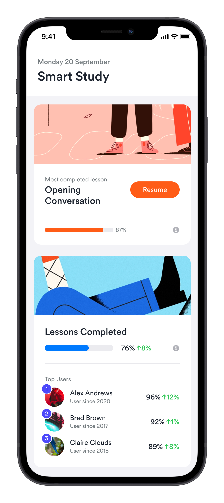

# Pairing Interview

### What you'll need
- Laptop
- Text editor to mock some JSON and UI components

### Intro

We want to introduce a new mobile feature that focuses on our user's progress through lessons. Currently, our users are unable to see how far they have progressed through the lessons we offer. By displaying their progress we hope to improve engagement, by motivating users to complete more lessons. We also want to include a leaderboard, so that we can introduce some friendly competition between our users.

Below is a design we have provided. We would like to see you design an API that will provide the data for the mobile application, as well as design the component(s) needed to achieve the UI.

We have already collected the user's progress and have that stored in a JSON file `progress.json` as well as the structure of the lessons `lessons.json`. We would like you to use these data sources in your solution.

Don't feel you have to rush a solution, you will not be judged on how far you get. We would much rather you give us a solution that you are proud of and feel best displays how you approach solving a problem.

### Requirements

- Display a user's overall lesson completion rate in percent.
- Display the lesson that has the highest progress for the user, do not display lessons that have been completed.
- Display the top three users with the highest overall lesson completion rate.

### Output

- List the endpoint(s) required to achieve this design
- Design the data structure the API would send to the client
- Design the data structure needed to populate the components
- How would you structure the components necessary to make up the UI?

### Tip

- A completed lesson is when all of the sections belonging to a lesson have a progress score of 100